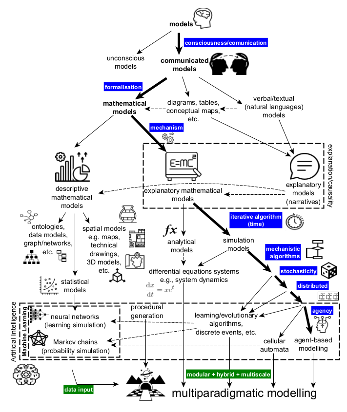
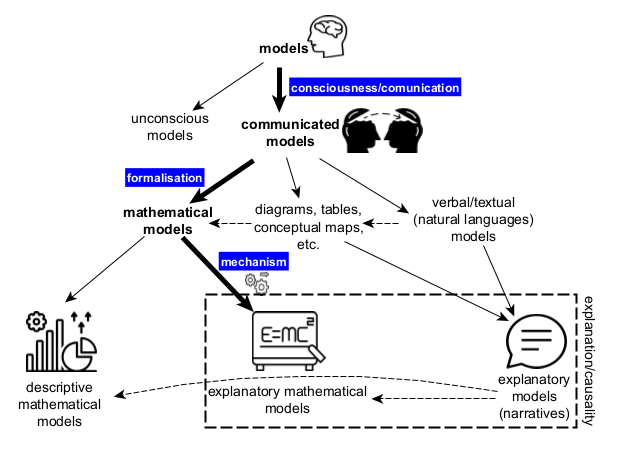
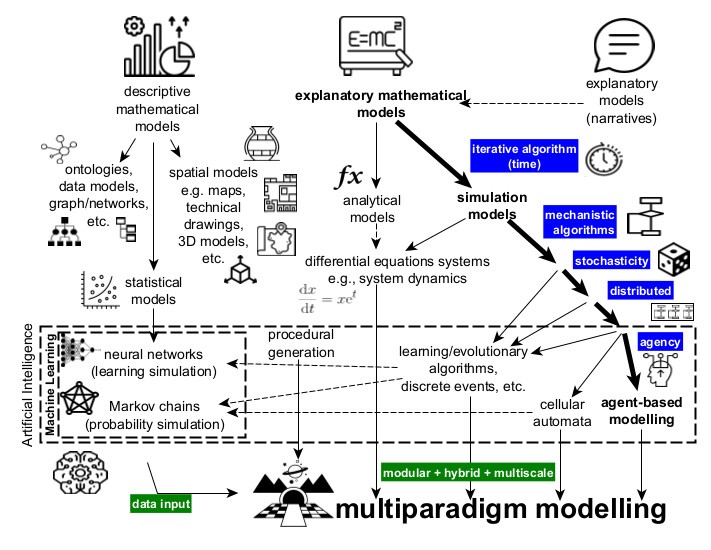

# From model to simulation models

Diagram showing a classification hierarchy going progressively from the term *model* to various types of *simulation models*.

## Full diagram

## Top part

## Bottom part

## Used in

Angourakis, A. (2023). Andros-Spica/CAA-Angourakis-2023: Simulation in the age of machine learning. Zenodo. https://doi.org/10.5281/zenodo.7803938

## Related references

Angourakis, A. (2023). El lugar de la simulación social en arqueología. Vegueta: Anuario de la Facultad de Geografía e Historia, 23(1), 15–55. https://doi.org/10.51349/veg.2023.1.02

## Icon assets attribution

The icons used were obtained at [The Noun Project](https://thenounproject.com/) (Basic free download under [Creative Commons Attribution 3.0 Unported](https://creativecommons.org/licenses/by/3.0/)). The attribution information was cropped to keep the wider graph cleaner. To acknowledge the creators, we list bellow the full attribution information for each icon:

(top part)
- "mind" by Rank Sol. [Image# 4465308](https://thenounproject.com/icon/mind-4465308/). Uploaded October 11, 2021. 
- "mind" by DinosoftLabs. [Image# 1901428](https://thenounproject.com/icon/mind-1901428/). Uploaded July 21, 2018.
- "mechanism" by Vector Portal. [Image# 4887394](https://thenounproject.com/icon/mechanism-4887394/). Uploaded July 31, 2020.
- "graphic" by WEBTECHOPS LLP. [Image# 2710984](https://thenounproject.com/icon/graphic-2710984/). Uploaded May 31, 2019.
- "formula" by Ifki rianto. (unfortunately this creator profile in The Noun Project was erased after the download of this icon). 
- "speak" by roma iskandar. [Image# 5256332](https://thenounproject.com/icon/speak-5256332/). Uploaded September 27, 2022.

(bottom part)
- "graphic" by WEBTECHOPS LLP. [Image# 2710984](https://thenounproject.com/icon/graphic-2710984/). Uploaded May 31, 2019.
- "formula" by Ifki rianto. (unfortunately this creator profile in The Noun Project was erased after the download of this icon). 
- "speak" by roma iskandar. [Image# 5256332](https://thenounproject.com/icon/speak-5256332/). Uploaded September 27, 2022.
- "Network" by Royyan Razka. [Image# 1082837](https://thenounproject.com/icon/network-1082837/). Uploaded May 30, 2017.
- "UML" by diyah farida. [Image# 5533424](https://thenounproject.com/icon/uml-5533424/). Uploaded January 26, 2023.
- "Data Model" by Tomas Knopp. [Image# 1632667](https://thenounproject.com/icon/data-model-1632667/). Uploaded March 09, 2018.
- "pottery" by Muhammad Shabraiz. [Image# 4966007](https://thenounproject.com/icon/pottery-4966007/). Uploaded June 20, 2022.
- "floor plan" by Eucalyp. [Image# 4975252](https://thenounproject.com/icon/floor-plan-4975252/). Uploaded June 24, 2022.
- "Map" by Eucalyp. [Image# 2625768](https://thenounproject.com/icon/map-2625768/). Uploaded May 07, 2019.
- "3D" by Doodle Icons. [Image# 4339909](https://thenounproject.com/icon/3d-4339909/). Uploaded June 21, 2021.
- "regression analysis" by Design Circle. [Image# 4859880](https://thenounproject.com/icon/regression-analysis-4859880/). Uploaded May 11, 2022.
- "Dueling neural networks" by sachin modgekar. [Image# 1714861](https://thenounproject.com/icon/dueling-neural-networks-1714861/). Uploaded April 26, 2018.
- "Markov Chain" by Knut M. Synstad. [Image# 1340836](https://thenounproject.com/icon/markov-chain-1340836/). Uploaded October 15, 2017.
- "function" by Yeong Rong Kim. [Image# 4866495](https://thenounproject.com/icon/function-4866495/). Uploaded May 06, 2022.
- "Time" by Supreme Dreams. [Image# 5543567](https://thenounproject.com/icon/time-5543567/). Uploaded January 31, 2023.
- "algorithm" by Srinivas Agra. [Image# 2310559](https://thenounproject.com/icon/algorithm-2310559/). Uploaded January 25, 2019.
- "Dice" by Arthur Shlain. [Image# 5536691](https://thenounproject.com/icon/dice-5536691/). Uploaded January 29, 2023.
- "decision" by Vectors Market. [Image# 1326934](https://thenounproject.com/icon/decision-1326934/). Uploaded October 12, 2017.
- "Artificial Intelligence" by Komkrit Noenpoempisut. [Image# 3469874](https://thenounproject.com/icon/artificial-intelligence-3469874/). Uploaded February 23, 2020.
- "cyberspace" by rdesign. [Image# 4868839](https://thenounproject.com/icon/cyberspace-4868839/). Uploaded May 19, 2022.
