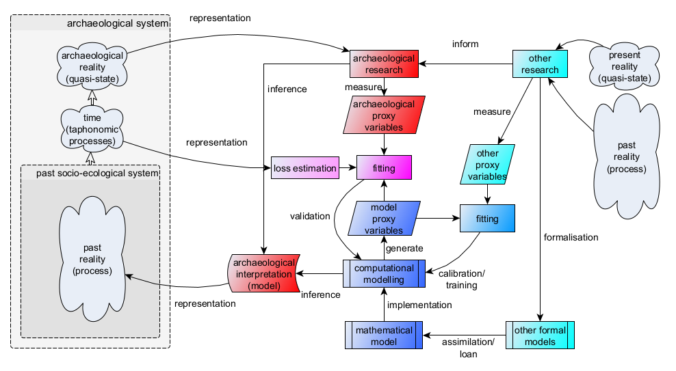

# Representation and validation of simulation models in archaeology

Diagrams showing the (potential) epistemological role of simulation modelling in archaeological research. Highlighted are the aspects of representation (what are the aspects considered essential to the target reality) and validation (how to ensure that the model generates patterns that are compatible with the available empirical data). A second derivative diagram is presented to show the epistemological differences of using descriptive mathematical modelling instead of explanatory mathematical modelling, such as simulation.

## Used in

Andreas Angourakis. (2024). Andros-Spica/Newcastle-Angourakis-2024: From pattern, through process, to mechanism. An introduction to simulation in archaeology (v1.0). Zenodo. https://doi.org/10.5281/zenodo.11145840

## Related references

## Icon assets attribution

