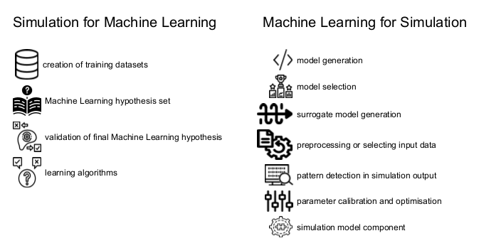

# Simulation and Machine Learning: potential combinations

Diagram structured in two columns listing how simulation can be used for machine learning and vice-versa.

## Used in

Angourakis, A. (2023). Andros-Spica/CAA-Angourakis-2023: Simulation in the age of machine learning. Zenodo. https://doi.org/10.5281/zenodo.7803938

## Related references

von Rueden, L., Mayer, S., Sifa, R., Bauckhage, C., & Garcke, J. (2020). Combining Machine Learning and Simulation to a Hybrid Modelling Approach: Current and Future Directions. In M. R. Berthold, A. Feelders, & G. Krempl (Eds.), Advances in Intelligent Data Analysis XVIII (Vol. 12080, pp. 548–560). Springer International Publishing. https://doi.org/10.1007/978-3-030-44584-3_43

## Icon assets attribution

The icons used were obtained at [The Noun Project](https://thenounproject.com/) (Basic free download under [Creative Commons Attribution 3.0 Unported](https://creativecommons.org/licenses/by/3.0/)). To acknowledge the creators, we list bellow the full attribution information for each icon:

(Simulation for Machine Learning)
- "dataset" by Chenyu Wang. [Image# 2200230](https://thenounproject.com/icon/dataset-2200230/). Uploaded December 07, 2018.
- "hypothesis" by Nithinnan Tatah. [Image# 2373338](https://thenounproject.com/icon/hypothesis-2373338/). Uploaded February 16, 2019.
- "difference" by Nithinnan Tatah. [Image# 4894766](https://thenounproject.com/icon/difference-4894766/). Uploaded May 23, 2022
- "hypothesis" by Kamin Ginkaew. [Image# 4929637](https://thenounproject.com/icon/hypothesis-4929637/). Uploaded June 06, 2022.

(Machine Learning for Simulation)
- "code" by Eva Ratkus. [Image# 4849309](https://thenounproject.com/icon/code-4849309/). Uploaded May 06, 2022.
- "ranking" by Komardews. [Image# 4703378](https://thenounproject.com/icon/ranking-4703378/). Uploaded March 18, 2022.
- "simplify" by Meko. [Image# 5418768](https://thenounproject.com/icon/simplify-5418768/). Uploaded December 20, 2022.
- "data processing" by M. Oki Orlando. [Image# 5625314](https://thenounproject.com/icon/data-processing-5625314/). Uploaded March 18, 2023.
- "analysis" by Orin zuu. [Image# 1210815](https://thenounproject.com/icon/analysis-1210815/). Uploaded August 21, 2017.
- "adjust" by Alice Design. [Image# 2474060](https://thenounproject.com/icon/adjust-2474060/). Uploaded March 22, 2019.
- "component" by WEBTECHOPS LLP. [Image# 3858570](https://thenounproject.com/icon/component-3858570/). Uploaded August 01, 2020.
